<div align="center">


# Resonate

**An offline music player for Android and iOS.**

It finds what is already on your phone, reads the tags off the files, builds a library
and plays it — with native lock-screen controls.

No streaming. No account. No network. Not one file is moved or renamed.


<table>
<tr>
<td>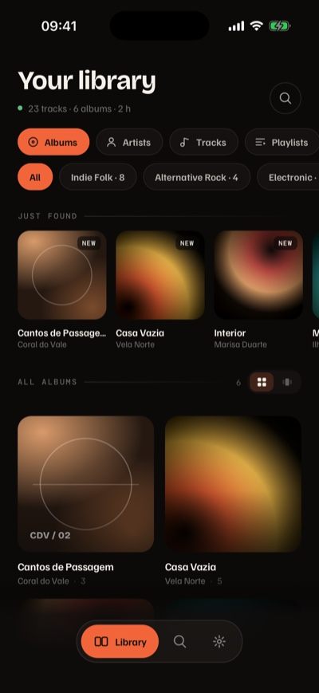</td>
<td>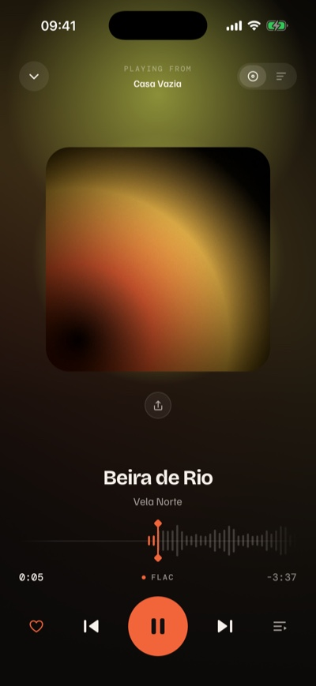</td>
<td></td>
</tr>
</table>

<sub>Screenshots are the real app on an iPhone 17 Pro simulator. The library is fictional — the
artists, albums and cover art do not exist.</sub>

</div>

---

## Why it exists

Almost every music player today assumes a library in the cloud. Resonate assumes the
opposite: the files are yours, they are on the device, and the app is just a good way to
listen to them.

That has consequences that show up all over the code. There is no cover art from a
catalogue — it is extracted from the file itself, or generated procedurally. There are no
"similar artists" from a recommendation service — similarity comes from the genre written
in the tag. Every one of those calls is written down in [`docs/03-decisoes.md`](docs/03-decisoes.md).

---

## What it does

### Library

Scanning reads tags directly: ID3v2.3/2.4, Vorbis comments (FLAC/OGG) and MP4 `ilst`.
Cover art is pulled out of the file — FLAC `PICTURE`, ID3 `APIC`, MP4 `covr` — and when
there is none, a deterministic procedural cover stands in. Duration is read from the
header when the system does not supply it. Albums, artists, tracks, folders, playlists.
Search matches tracks, albums and artists, ignoring accents and case.

<table>
<tr>
<td>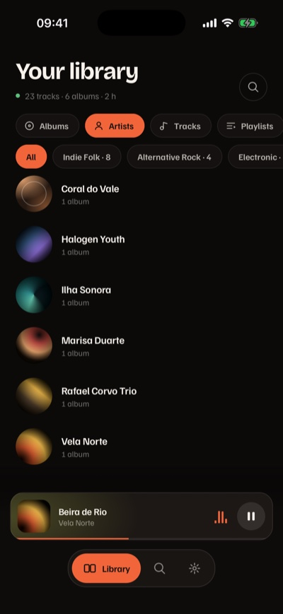</td>
<td>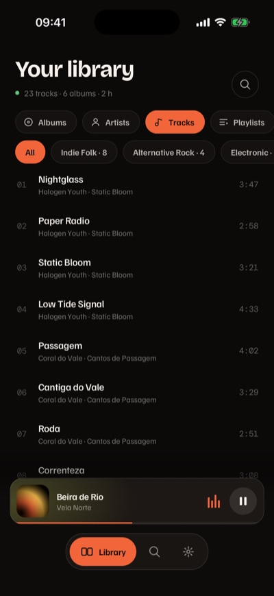</td>
<td>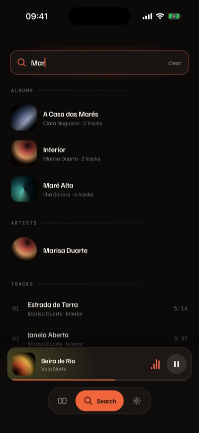</td>
</tr>
<tr>
<td align="center"><sub>Artists</sub></td>
<td align="center"><sub>Tracks</sub></td>
<td align="center"><sub>Search — accent-insensitive</sub></td>
</tr>
</table>

### Album and artist

Opening an album flies its cover from the grid into the new screen; everything else fades
in. The artist screen has a parallax header built out of the album art.

<table>
<tr>
<td>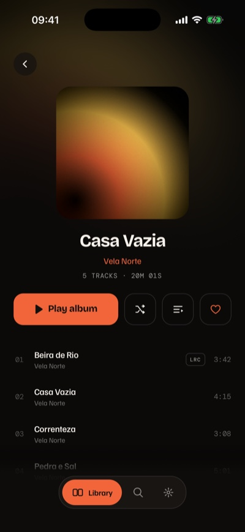</td>
<td>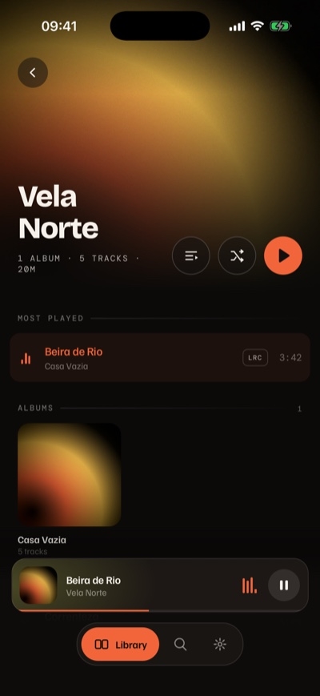</td>
<td>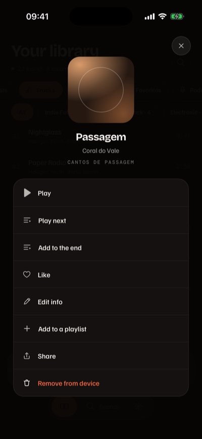</td>
</tr>
<tr>
<td align="center"><sub>Album</sub></td>
<td align="center"><sub>Artist</sub></td>
<td align="center"><sub>Hold any track</sub></td>
</tr>
</table>

### Now Playing

Three visual treatments — **Ember**, **Vinyl** and **Wave**. Swipe the cover to change
track, drag the seek tape to scrub. Pull down to minimise; pull the mini player up to
maximise.

<table>
<tr>
<td></td>
<td>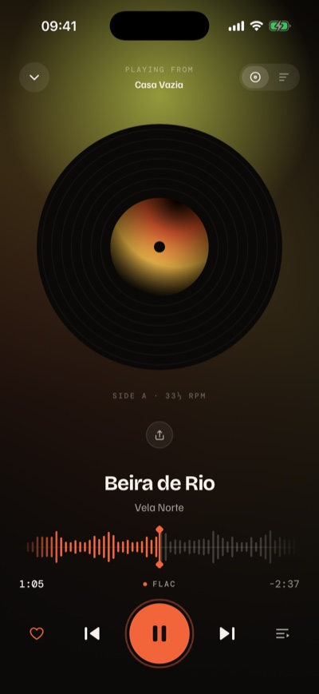</td>
<td>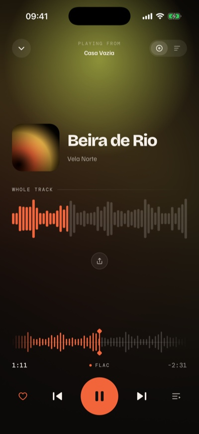</td>
</tr>
<tr>
<td align="center"><sub>Ember</sub></td>
<td align="center"><sub>Vinyl</sub></td>
<td align="center"><sub>Wave</sub></td>
</tr>
</table>

### Lyrics

Synced lyrics from a `.lrc` next to the file or embedded in the tag, behaving the way the
Music app does: the whole lyric scrolls, the current line stays opaque and anchored near
the top, and tapping a line seeks to it.

### Queue and what plays next

The queue is editable — reorder by dragging, remove with a tap. When it runs out, Resonate
can keep going: by album, by artist, or **by genre**, which is the only similarity signal
that exists without a network.

<table>
<tr>
<td>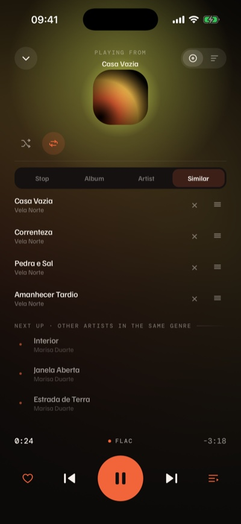</td>
<td>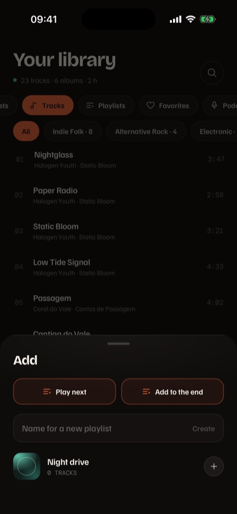</td>
<td>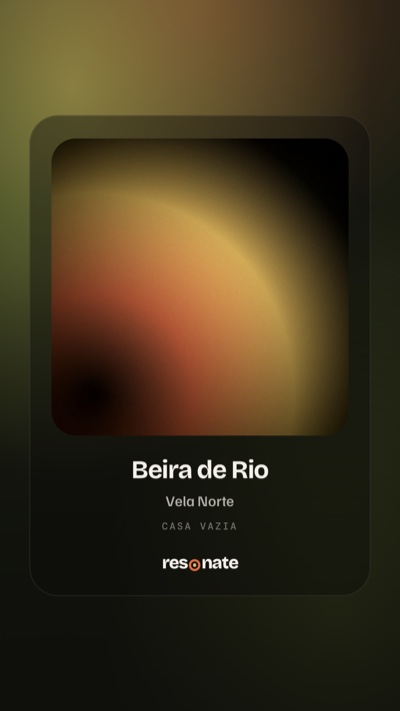</td>
</tr>
<tr>
<td align="center"><sub>Queue · continuation by genre</sub></td>
<td align="center"><sub>Swipe left on a track</sub></td>
<td align="center"><sub>Share card</sub></td>
</tr>
</table>

### Podcasts and audiobooks

Spoken word is separated from music, in this order of trust: your manual mark on the album
wins; then the genre tag; then, as a last resort, duration — nothing 25 minutes long is a
song. Audiobooks can be sliced into **listening sessions** of 30, 45 or 60 minutes, because
people listen to books by time, not by chapter.

<table>
<tr>
<td>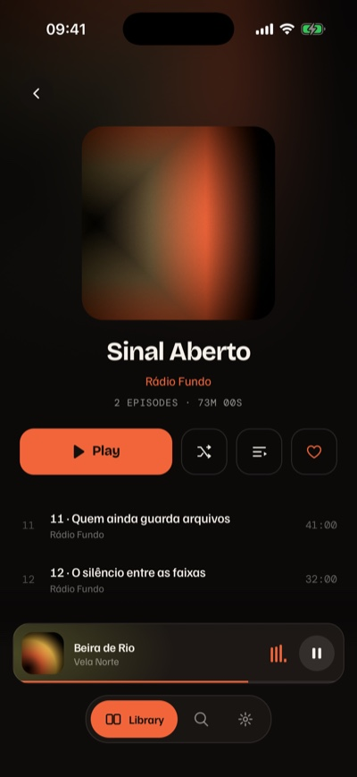</td>
<td>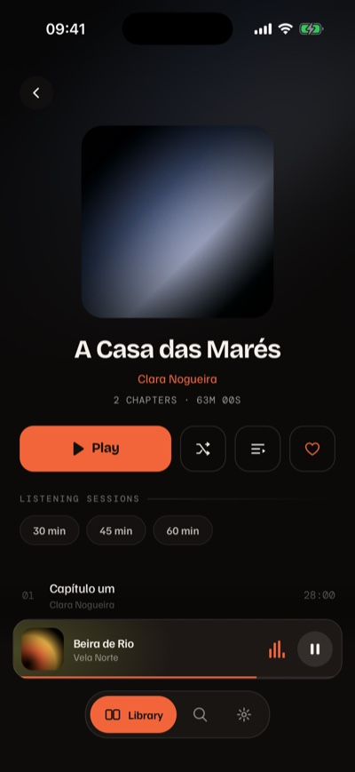</td>
<td>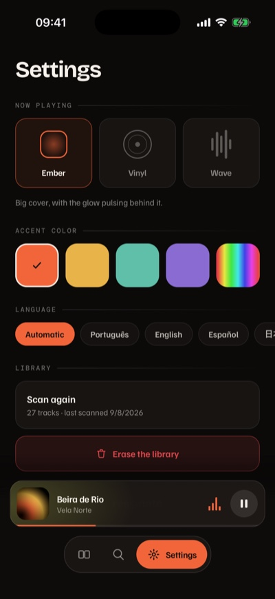</td>
</tr>
<tr>
<td align="center"><sub>A show</sub></td>
<td align="center"><sub>A book, in sessions</sub></td>
<td align="center"><sub>Settings</sub></td>
</tr>
</table>

### Listening stats

Counted on the device, from what you actually played — a track enters the tally after
thirty seconds. Hours, top artists, top albums, top tracks, and the hour of day you listen
in, over the last week, month, year or all of it. Rankings go by **time**, not by play
count: an album heard once end to end is not less than a two-minute song on repeat.

Nothing is uploaded, because there is nowhere to upload it to. You can erase the whole
history from the same screen.

### Sleep timer

Five to sixty minutes, or *end of track*. The audio fades out over the last eight seconds
rather than cutting — a hard stop wakes up exactly the person who set the timer.

### Also

- **Playlists** — create, rename, delete, reorder by dragging, pick a cover from the
  gallery. Swipe a track right to queue it, left to open the playlist picker.
- **Metadata fixes** — correct title, artist, album, track number and genre. The
  correction lives in the app, never in your file.
- **Five languages** — Portuguese, English, Spanish, Japanese and Chinese, following the
  device by default.
- **Four accent colours**, plus a free hue and saturation picker. Dark only, on purpose.
- **Background playback** and native lock-screen controls with cover and metadata.

---

## First run

Onboarding asks for access, lists the folders that have audio in them, and lets you switch
each one on or off. The scan then reads every file in batches, showing progress, counters
and the file it is on.

<table>
<tr>
<td>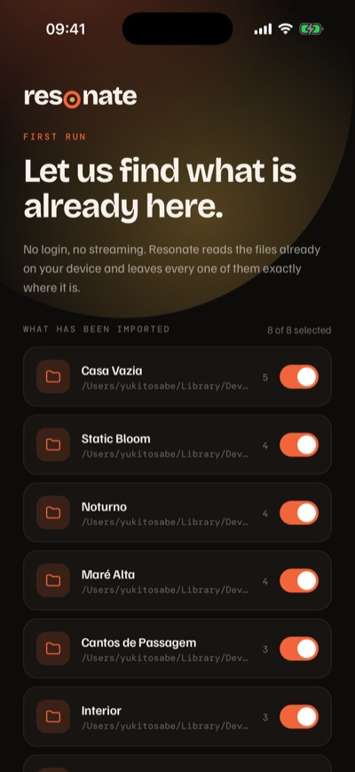</td>
<td>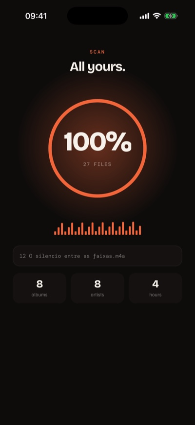</td>
</tr>
</table>

---

## Running it

The app uses native audio and media-library modules — **it does not run in Expo Go**.

```sh
npm install
npx expo run:android   # or: npx expo run:ios
```

After the first build, `npx expo start` is enough.

> When you add or rename a route, run `npx expo start` once before `tsc`: route types are
> generated by Metro into `.expo/types/`, and without that the check uses the old list.

## Verifying

```sh
npm run typecheck   # tsc --noEmit, strict
npm run lint        # includes the React Compiler rules
npm test            # 134 tests, in Node, no emulator — needs Node 22.18+
```

The tests cover what can be checked without a device and is easy to break silently: the
tag reader across four formats, duration maths, the `.lrc` parser, search, file
deduplication, queue continuation, spoken-word classification, listening sessions, the
metadata-edit layer, colour maths and the translation dictionary. Binary buffers are
assembled inside the tests — there are no fixtures in the repository.

`npm test` runs `.ts` files through Node directly, which needs the type stripping that
landed in **Node 22.18**. On older Node it fails with `ERR_UNKNOWN_FILE_EXTENSION`; run
`node --experimental-strip-types --test src/lib/*.test.ts` instead.

## How the code is organized

```
src/
  app/          routes (expo-router, file-based)
  components/   interface pieces
  lib/          tags, scanning, playback, state, transitions
  constants/    design tokens
modules/
  live-activity/  native iOS module (Dynamic Island)
  story-share/    native Instagram Stories intent
  audio-route/    native audio output route
  equalizer/      native Android output equalizer
docs/           context, architecture, decisions
```

State lives in five contexts, with no state-management library: preferences, library,
playlists, player and transition. The library and the listening history live in SQLite;
preferences, playlists and the queue are small JSON files.

## The interesting parts

**The tag reader** has no dependencies. It works on `Uint8Array` and never reads the whole
file — a FLAC can be tens of megabytes, of which a few kilobytes are metadata. When the tag
declares its own size, it reads exactly that. Formats it does not cover fall back to
deriving artist, album and title from the file path. Details in
[`docs/04-tags-e-formatos.md`](docs/04-tags-e-formatos.md).

**Cover art** is read by seeking rather than reading sequentially, which makes it possible
to hop from block to block. That solves, for free, the MP4 with `moov` at the end of the
file that the tag reader cannot reach.

**Procedural art** is an FNV-1a hash of artist + album indexing a palette. The same album
always gets the same cover, with no I/O and no network.

**The transitions** are hand-written. Reanimated 4's shared element transitions are still
experimental, need a feature flag, and have known positioning problems on iOS. The cover is
measured at its origin and animated to its own layout position, with the inverse transform
undone — no second copy of the element.

**Album, artist and Now Playing are not routes**, they are layers of the root layout. As
router screens with `presentation: 'transparentModal'` they were native windows on Android,
so the bottom bar could not reach over them and the mini player unmounted and remounted on
every open and close — **547 ms of blocked JS thread** after closing, measured with a frame
probe.

**Nothing absolute is written to disk.** A track's id is its path, and on iOS the path to
the app's Documents folder contains the container UUID — which changes on reinstall, on
restore, on some updates. Stored absolute, every id, cover path and playlist entry died
with it: the library pointed at nothing until you rescanned. References go to disk in a
portable form (`doc://Music/x.flac`) and are rebuilt against the root that is current.
`src/lib/paths.ts` is pure and tested; `src/lib/storage.ts` is the twenty lines that know
where the root is.

## Android and iOS

"Where are the files?" has incompatible answers on the two platforms, and a single
interface in `src/lib/sources.ts` isolates that. The rest of the app is identical.

| | Android | iOS |
|---|---|---|
| Source | MediaStore, plus folders granted through SAF | the app's Documents folder |
| How to add | already on the device | import, or drag into the Files app |
| Permission | `READ_MEDIA_AUDIO` | none |
| Duration | comes from MediaStore | derived from the header |
| `.lrc` next to the file | unreadable (media only) | readable |

On modern Android there is no browsing storage freely: folders outside indexed media go
through the system picker. More in [`docs/06-plataformas.md`](docs/06-plataformas.md).

## Known limits

Written down because knowing the ceiling is worth more than pretending it isn't there:

- **Track changes are not gapless.** `setActiveForLockScreen` exists only on `AudioPlayer`,
  not on `AudioPlaylist`, and without media controls Android kills background audio. The
  queue is our own, and changing track reloads the player.
- **The notification only offers seek.** Next and previous would need controls that
  `expo-audio` 57 does not expose yet.
- **No equalizer.** A filter has to sit in the signal path, and `expo-audio` exposes
  neither its audio session nor a graph to enter. The way in is a playback engine we own —
  see `docs/07-roadmap-e-divida.md`.
- **The Dynamic Island has not been compiled.** The Swift module is written; the widget
  target still has to be created in Xcode — steps in the
  [module README](modules/live-activity/README.md).
- **Without a genre tag, "similar" has nothing to suggest.** It is the only similarity
  criterion available offline.
- **The library is in SQLite but still materialised in memory.** Writes are incremental and
  loading is a query rather than a `JSON.parse`, which is where the old ceiling was. The
  array itself is the next one: above roughly 20,000 tracks the screens have to start
  querying instead of receiving the whole list.

Deliberate shortcuts carry a `ponytail:` comment at the exact spot, naming the ceiling and
the way out. To list them: `grep -rn "ponytail:" src/`.

## Documentation

The [`docs/`](docs/README.md) folder is written to be read by people and by RAG — each file
is thematic and each section stands on its own. **The docs are in Portuguese.**

| | |
|---|---|
| [01-contexto](docs/01-contexto.md) | the product, what it does, what changed from the prototype |
| [02-arquitetura](docs/02-arquitetura.md) | folders, data flow, state, persistence |
| [03-decisoes](docs/03-decisoes.md) | the technical decisions, with context and consequences |
| [04-tags-e-formatos](docs/04-tags-e-formatos.md) | the tag reader, format by format |
| [05-design-system](docs/05-design-system.md) | tokens, typography, and what did not survive React Native |
| [06-plataformas](docs/06-plataformas.md) | Android, iOS, permissions, verification script |
| [07-roadmap-e-divida](docs/07-roadmap-e-divida.md) | future ideas and the debt marked in the code |

The design came out of an HTML/CSS prototype delivered as
`Offline Music Player App-handoff/…/Resonate - Offline Player.dc.html`, which is still the
source of visual truth — the typography, spacing and colour values come from its inline
styles.

## License

Copyright © 2026 Juan Almeida.

Resonate is free software: you can redistribute it and/or modify it under the terms of the
**GNU General Public License, version 3**, as published by the Free Software Foundation.

It is distributed in the hope that it will be useful, but WITHOUT ANY WARRANTY; without
even the implied warranty of MERCHANTABILITY or FITNESS FOR A PARTICULAR PURPOSE. See
[`LICENSE`](LICENSE) for the full text.

Copyleft is the point: a player that promises never to phone home is a promise you should
be able to check, and anyone who ships a modified Resonate has to let you check theirs too.
